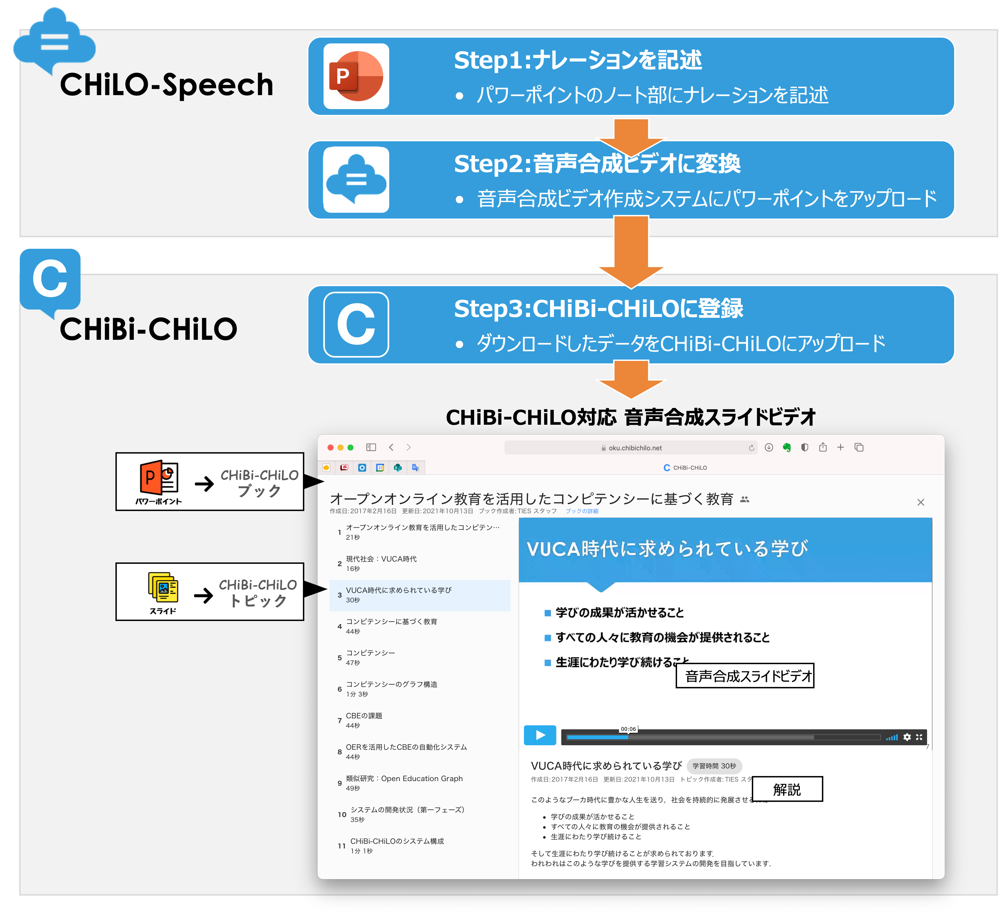

# はじめに

#### CHiLO-Speechを使うためには，以下のものを準備して下さい

1. [CHiBi-CHiLOに接続するLMSのアカウント](prepare/lms.md)
2. [パワーポイントデスクトップ版（Office2016以上）あるいはWeb版](prepare/powerpoint-1.md)

#### CHiLO-Speechを利用したビデオ教材作成の手順は次の通りとなります

Step1：[パワーポイントにナレーションを記述する](narration/describe.md)

Step2：[パワーポイントをGithubにアップロードしCHiBi-CHiLO登録データを入手する](video/convert-web.md)

Step3：[CHiBi-CHiLOに登録する](chibi-chilo/registration.md)

#### CHiLO-Speechで作成するビデオ教材 

CHiLO-Speechは，スライド毎に分割されたCHiBi-CHiLO対応の合成音声ビデオ教材を作成します．

CHiBi-CHiLOではビデオ教材全体を **「ブック」** ，スライド毎のビデオを **「トピック」** と呼んでいます．ブックとトピックの詳細については，以下をご確認下さい．



<figure><figcaption></figcaption></figure>
