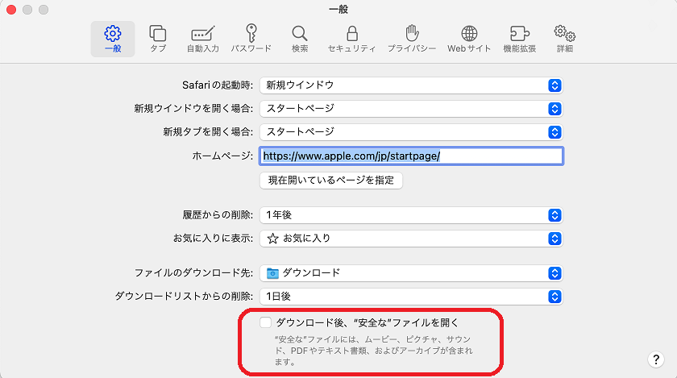

# FAQ

### Q. パワーポイントにアドインを追加できない

まず，ご使用のパワーポイントが動作環境を満たしているかご確認ください．（[パワーポイントの準備（1）](../prepare/powerpoint-1.md)）

動作環境を満たしており，最新版に更新しても追加出来ない場合はWeb版のパワーポイントでお試しください．

### Q. 音声合成ビデオの変換に失敗する

こちらのページにて失敗する原因を解説してますのでご確認ください．（[\[参考\]変換に失敗した場合](../video/fail-conversion.md)）

* ファイル名に日本語や全角文字が使用されている
* スライドの枚数とスライド画像のフォルダにある画像の数が一致していない

### Q. CHiBi-CHiLOに登録した教材に埋め込んだ動画が反映されない

CHiLO-Speechでは，動画のあるスライドには対応しておりませんので，別途ストリーミングサーバー等にアップする必要がございます．手順は以下の通りです．

1.動画ファイルを削除し，スライドタイトルだけとしたパワーポイントで，音声合成ビデオを作成し，それをCHiBi-CHiLOに登録します．

2\. 別途，動画をストリーミングサーバーにアップしておきます．

3.手順1で作成したトピックの「動画のURL」を，手順2でアップした動画のURLに置き換えて保存します．

### Q. GitHubに25MB以上のパワーポイントがアップできない

GitHubでは，ブラウザでのドラッグ＆ドロップによるファイルのアップロードは，25MB以上のファイルには対応しておりません．\
対応方法として，2つの方法があります．

#### 1）ビデオ教材を二つに分割する

\
スライドを分割して，二つのブックとして，CHiBi-CHiLOに登録し，後で1つのブックにまとめることができます．\
どちらか片方のブックの編集画面で，「ブックの再利用」をクリック（添付画像）すると，登録したもう片方のブックのトピックが選べますので，チェックを入れると，1つのブックにまとめることができます．

.png>)

#### 2）Github Desktopアプリを使う

GitHub公式のGithub Desktopアプリを使うと，25MB以上のファイルもアップロードが行なえます．\
[GitHub Desktop](https://desktop.github.com/)

詳細は，以下GitHubの公式マニュアルをご参照ください．

[GitHub Desktopのインストール方法\
](https://docs.github.com/ja/desktop/installing-and-configuring-github-desktop/installing-and-authenticating-to-github-desktop/installing-github-desktop)

### Q. GitHubからダウンロードしたZipファイルが自動的に展開されてしまう

macOSのSafariで，GitHubからダウンロードしたZipファイルが自動的に展開され，jsonファイルや動画ファイルなどが表示される場合は，以下のように設定をご変更ください．

1. 画面上部の「Safari」をクリックし，「環境設定」を選択します．
2. 一般タブで， 「ダウンロード後，“安全な”ファイルを開く」のチェックを外します．\

### Q. CHiLO-Speechアドインの画面がマニュアルと異なる

古いアドインのキャッシュが残っている可能性があります．

以下のリンクを参考に，キャッシュのクリアをお試しください．

[Office のキャッシュをクリアする - Office Add-ins | Microsoft Docs](https://docs.microsoft.com/ja-jp/office/dev/add-ins/testing/clear-cache)
