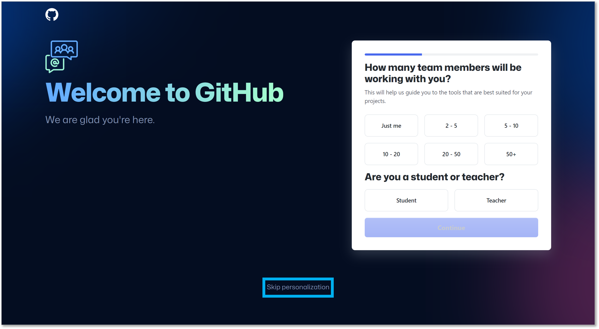

# 2．GitHubアカウントの準備

GitHubのレポジトリにナレーション原稿を記述したパワーポイントを保存すると，自動的に合成音声ビデオ教材のデータが生成されます．

GitHub（ギットハブ）とは，世界中の人々が自分の作品（プログラムのソースコードやデザインデータ）を保存し，公開しているウェブサービスです． レポジトリとはGitHubのデータ保管庫で，そこに作品のデータを保存，許可されたユーザー（あるいは誰でも）が共同で改変・修正して作品を更新していくことができます．

CHiLO-Speechでは**，組織毎に合成音声ビデオ教材を作成するための専用レポジトリを準備しています．**

専用レポジトリにアクセスするために以下の準備をして下さい．\

### （1）GitHubのアカウントを作成

❶ [https://github.com](https://github.com)（外部サイトに移動）にアクセスします．&#x20;

❷ ボックスに登録するメールアドレスを入力し，**「Sign up for GitHub」**をクリックします．

.png>)

❸ 画面の指示に従ってアカウント登録をします．

GitHubのアカウント作成方法は多くの人がサイトで紹介しています．是非参考にして下さい．

* [GitHub速攻入門 – プログラマーやめました](https://www.premium-tsubu-hero.net/start-github/%E2%80%8B)（外部サイトに移動）
* [GitHubアカウントの作成方法 (2021年版) - Qiita](https://qiita.com/ayatokura/items/9eabb7ae20752e6dc79d)（外部サイトに移動）
* [1分もかからない！5ステップでGitHubアカウント作成 | アールエフェクト](https://reffect.co.jp/html/create\_github\_account\_first\_time)（外部サイトに移動）

登録の最後に，利用するプランや属性を最適化する画面が表示されますが，画面下部の「Skip personalization」をクリックすることでスキップできます．スキップしても，後述の専用レポジトリへのアクセスには影響ありません．

<figure><figcaption></figcaption></figure>

### （2）専用レポジトリへのアクセス権取得

❶ 管理者に取得したGitHubアカウントを伝え，専用レポジトリの書き込み権限を付与するよう依頼して下さい．&#x20;

❷ 管理者がアクセス権を付与すると，アカウント登録をしたメールアドレスに**「noreply@github.com 」**からInvitationメールが届きます．&#x20;

❸ **「View invitation」**をクリックして招待を許諾します．

.png>)
