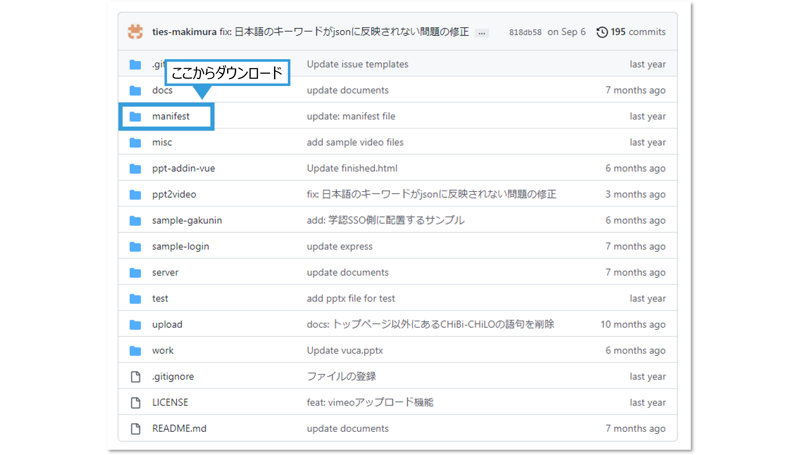

# 3．パワーポイントへのアドイン登録

## パワーポイントの種類について

CHiLO-Speechアドインは，以下のパワーポイントに登録することができます．


* Web版パワーポイント（Office on the web）
* デスクトップ版パワーポイント（Microsoft office2016以上）


Web版パワーポイントとは，Webブラウザで利用することができるパワーポイントです．Office on the webにユーザー登録して無料で利用できるほか，Office365のアカウントでも利用することができます．

Web版パワーポイントはデスクトップ版と比較し，アドインを簡単に登録することができます．ただし，デスクトップ版に比べて機能が限定されています．また，パソコンに保存されたパワーポイントファイルを直接編集できないため，ファイルを一旦，OneDriveやSharePointにアップロードしてから，編集しなければいけません．

従って，デスクトップ版パワーポイントでスライドを作成し，ナレーションスクリプトを追加する時だけ，Web版パワーポイントを利用することをお勧めいたします．

* アカウントをお持ちの方はから[**こちら**](https://www.office.com/launch/powerpoint?auth=2)からOneDriveアクセスできます．

## CHiLO-Speechアドインの登録方法

### （1）マニフェストファイルの取得

マニフェストファイル（manifest.xml）とは，アドインをパワーポイントに登録するために必要なファイルです． マニフェストファイルは利用機関により異なっています．まず，利用機関のGitHubレポジトリの「manifest」フォルダから，マニフェストファイルをダウンロードして取得してください．

<figure><figcaption></figcaption></figure>

ファイルのダウンロード方法については，以下をご覧ください．

* [\[参考\] GitHubのファイル操作 - ファイルのダウンロード](broken-reference)

### （2）マニフェストファイルの保存

パソコンの任意の場所に **「manifest」** と言う名前のフォルダを作成し，そこに取得したマニフェストファイル（manifest.xml）を保存します．

**以降の設定方法はWeb版，デスクトップ版，OSによって異なります．**



### 【Web版の場合】

### （3）パワーポイントの設定

❶ OneDriveにアクセスし，パワーポイントを開きます．

* アカウントをお持ちの方はから[**こちら**](https://www.office.com/launch/powerpoint?auth=2)からOneDriveアクセスできます．

.png>)

❷ パワーポイントメニューの **「ホーム」→「アドイン」** を選択します． **「アドイン」** のメニューが表示されない場合は，メニュー右下のマークをクリックしてリボンを表示して下さい．

❸ **「個人アドイン」** メニューで **「アドインのアップロード」** をクリックします．

.png>)

❹ **「参照」** をクリックして，保存したマニフェストファイルを選択し， **「アップロード」** をクリックします．

❺ ホームに追加される **「CHiLO-Speech」** をクリックすると， アドインが表示されます．

.png>)



### 【デスクトップ版・Windows の場合】

### （3）マニフェストファイルの設定

❶ 作成したmanifestフォルダを右クリックしてプルダウンメニューを表示し， **「プロパティ(R)」** 選択します．

❷ プロパティダイアログボックスの **「共有」** タブを選択し， **「共有(s)...」** をクリックします．

.png>)

❸ **「共有する相手を選んでください」** というダイアログボックスが現れるので，自分のユーザー名が選択されていることを確認し， **「共有(H)」** をクリックします．

❹ **「すべてのパブリックネットワークにネットワークの探索とファイル共有を有効にしますか？」** というダイアログボックスが現れるので， **「いいえ、接続しているネットワークをプライベートネットワークにします」** をクリックします．

.png>)

❺「終了」をクリックします．

❻ 「共有」タブに戻るので，ネットワークパスの¥マーク二つから始まるアドレス部分（例：¥¥DESKTOP¥Users¥ties-staffxx¥document¥manifest）をコピーします．（2-3 ❹で使用します．）

❼「閉じる」をクリックしてプロパティダイアログボックスを閉じます．

.png>)

### （4）パワーポイントの設定

❶ パワーポイントを起動します．

❷ パワーポイントのメニューの **「ファイル」→「オプション」→「トラストセンター」→「トラストセンターの設定(T)...」** を開きます．

.png>)

❸ トラストセンターのメニューで **「信頼できるアドインカタログ」** を選択します．

❹ カタログのURLに（2−1）でコピーしたをアドレスをペーストして， **「カタログの追加(A)」** をクリックします．

❺ 追加したアドレスがテーブルに表示されたことを確認し **「メニューに表示する」** にチェックを入れ、 **「OK」** をクリックします．

.png>)

❻ パワーポイントを再起動します．

❼ パワーポイントが再起動したら，パワーポイントのメニューの **「開発」→「アドイン」** を選択します． **「アドイン」** のメニューが表示されない場合は，メニュー右下のマークをクリックしてリボンを表示して下さい．

❽ Officeアドインダイアログボックス **「共有フォルダー」** タブを選択し， **「CHiLO-Speech」** を選択して **「追加」** をクリックします．

.png>)

❾ **「CHiLO-Speech」** をクリックすると， アドインが表示されます．

.png>)



### 【デスクトップ版・macOS の場合】

### （3）フォルダ作成

❶ DockのLanchpadから **「ターミナル」** と検索してターミナルを開きます．&#x20;

.png>)

❷ ターミナルに以下のコマンドをコピー＆ペーストして **「wef」** フォルダを作成します．

```
mkdir ${HOME}/Library/Containers/com.microsoft.Powerpoint/Data/Documents/wef
```

❸ ターミナルに以下のコマンドをコピー＆ペーストして，作成した **「wef」** フォルダを開きます．

```
open ${HOME}/Library/Containers/com.microsoft.Powerpoint/Data/Documents/wef
```

####

### （4）マニフェストファイルの移動

Finderで開いたフォルダに取得したマニフェストファイルを移動します．

.png>)

### （5）アドインの設定

❶ パワーポイントを起動します．

❷ パワーポイントメニューの **「挿入」** をクリックします．

❸ 個人用アドインの右側にある **「下矢印」** をクリックします．

❹ 表示されるプルダウンメニューから， **「CHiLO-Speech」** をクリックします.&#x20;

.png>)

❺ アドインが追加表示されます．

.png>)



